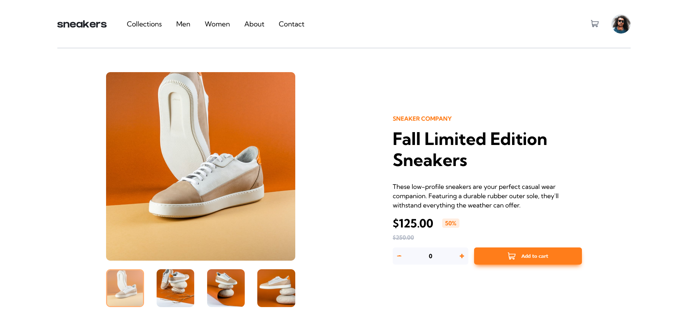

# Frontend Mentor - E-commerce product page solution

This is a solution to the [E-commerce product page challenge on Frontend Mentor](https://www.frontendmentor.io/challenges/ecommerce-product-page-UPsZ9MJp6). Frontend Mentor challenges help you improve your coding skills by building realistic projects.

## Table of contents

-  [Overview](#overview)
   -  [The challenge](#the-challenge)
   -  [Screenshot](#screenshot)
   -  [Links](#links)
-  [My process](#my-process)
   -  [Built with](#built-with)
   -  [What I learned](#what-i-learned)
   -  [Continued development](#continued-development)
   -  [Useful resources](#useful-resources)
-  [Author](#author)

**Note: Delete this note and update the table of contents based on what sections you keep.**

## Overview

### The challenge

Users should be able to:

-  View the optimal layout for the site depending on their device's screen size
-  See hover states for all interactive elements on the page
-  Open a lightbox gallery by clicking on the large product image
-  Switch the large product image by clicking on the small thumbnail images
-  Add items to the cart
-  View the cart and remove items from it

### Screenshots

***Big Layout***\


***Medium Layout***\


***Small Layout***\


***Mobile Layout***\


### Links

-  Solution URL: [Github Repository](https://github.com/jordan-na/eccomerce-product-page-responsive.git)
-  Live Site URL: [Hosted on Github Pages](https://jordan-na.github.io/eccomerce-product-page-responsive/)

## My process

### Built with

-  Semantic HTML5 markup
-  CSS custom properties
-  Flexbox
-  CSS Grid
-  Mobile-first workflow
-  Vanilla JS
-  ES6 module patterns with IIEF's

### What I learned

-  Non-technical skills:

   -  How to turn an abstract concept into concrete results by breaking the task at hand into smaller tasks
   -  Ability to plan and stick to a work schedule with an estimated date of completion
      -  Day 1: Create desktop design (HTML, CSS)
      -  Day 2: Create mobile design (HTML, CSS)
      -  Day 3: Implement vanilla JS
   -  Perserverance to finish the task, even through challenging times

-  Technical skills:
   -  Responsive UI/UX development
      -  Using the chrome inspector to emulate different screen sizes
   -  Adding an MVC like design pattern to organize program logic
      -  Model: _cart.mjs_ represents the virtual cart instance to keep track of items dynamically, not just the item from the static page that was given
      -  View: _index.html_ contains the entire UI
      -  Controller: _image-controller.mjs_, _cart-controller.mjs_, and _event-handler.mjs_
         -  _image-controller.mjs_ contains all the callback logic for user events that change images in both the main image display and lightbox
         -  _cart-controller.mjs_ contains all the callback logic for user events that update the cart
         -  _event-handler.mjs_ sets up all the event listeners to have callback functions that were defined in image-controller.mjs and cart-controller.mjs
   -  ES6 JS module design pattern
      -  Exporting of IIEF's were used to allow _encapsulation_ (see code example below)

```js
export const cartController = (() => {
   // OTHER FUNCTIONS NOT INCLUDED HERE (see cart-controller.mjs)
   const fadeOut = (duration, productItem) => {
      return new Promise((resolve, reject) => {
         productItem.style.webkitAnimation = `delete ${duration}s`;
         setTimeout(() => {
            resolve();
         }, duration * 1000);
      });
   };
   // OTHER FUNCTIONS NOT INCLUDED HERE (see cart-controller.mjs)
   return {
      showCart: showCart,
      unshowCart: unshowCart,
      addToCartElement: addToCartElement,
      removeFromCartElement: removeFromCartElement,
      darkenDelBtn: darkenDelBtn,
      lightenDelBtn: lightenDelBtn,
   };
})();
// *fadeOut is a private function that other js files should not be able to access*
```

-  I also learned how to simplify the code in _app.js_ via use of modules (see code example below)

```js
import { eventHandler } from "./modules/event-handler.mjs";

const init = () => {
   eventHandler.setupEventListeners(); // Only line that sets up all app logic
};

window.onload = init;
```

### Continued development

-  I will continue to refine my vanilla JS and no-framwork CSS approach before moving onto libraries/frameworks
-  After I have complete a multitude of no library/framework projects, I will learn _React_ and implement it with my knowledge of _Node.js_ and _Express.js_
- Eventually, the goal is to complete a full stack web app that has a use for society

### Useful resources

-  [MDN](https://developer.mozilla.org/en-US/docs/Web/JavaScript) - This helped me by acting as a reference for the built in js API

## Author

-  Name: Jordan Na
-  Website - [Github Profile](https://github.com/jordan-na)
-  Frontend Mentor - [@jordan-na](https://www.frontendmentor.io/profile/jordan-na)
-  Email - jordster02@gmail.com
